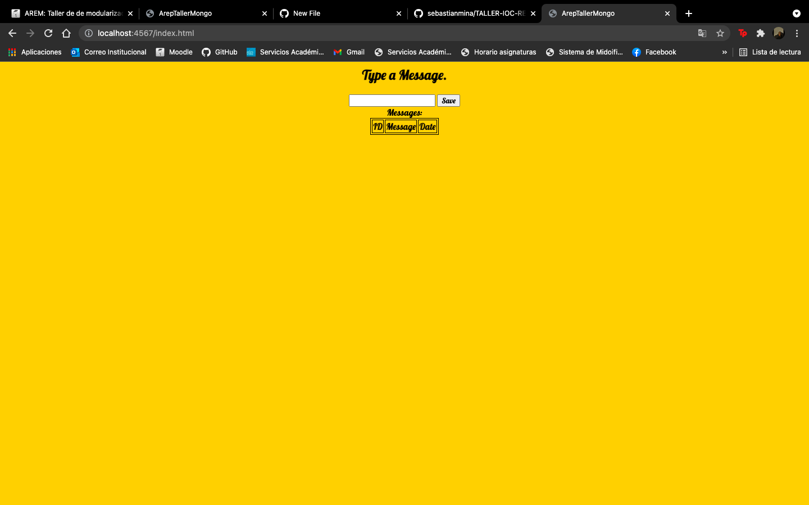

# TALLER DE DE MODULARIZACIÓN CON VIRTUALIZACIÓN E INTRODUCCIÓN A DOCKER Y AWS

>1. El servicio MongoDB es una instancia de MongoDB corriendo en un container de docker en una máquina virtual de EC2.

>2. LogService es un servicio REST que recibe una cadena, la almacena en la base de datos y responde en un objeto JSON con las 10 ultimas cadenas almacenadas en la base de datos y la fecha en que fueron almacenadas.
>3. La aplicación web APP-LB-RoundRobin está compuesta por un cliente web y al menos un servicio REST. El cliente web tiene un campo y un botón y cada vez que el usuario envía un mensaje, este se lo envía al servicio REST y actualiza la pantalla con la información que este le regresa en formato JSON. El servicio REST recibe la cadena e implementa un algoritmo de balanceo de cargas de Round Robin, delegando el procesamiento del mensaje y el retorno de la respuesta a cada una de las tres instancias del servicio LogService.

## Local

## Desplegado en AWS

http://ec2-54-152-196-156.compute-1.amazonaws.com:42000/index.html

## Autor 

[Sebastián Mina](https://github.com/sebastianmina)

## Licencia & Derechos de Autor
**©** Sebastián Mina, Estudiante de Ingeniería de Sistemas de la Escuela Colombiana de Ingeniería Julio Garavito

Licencia bajo la [GNU General Public License](https://github.com/sebastianmina/AREP-TALLER-DOCKER/blob/master/LICENSE.txt)
